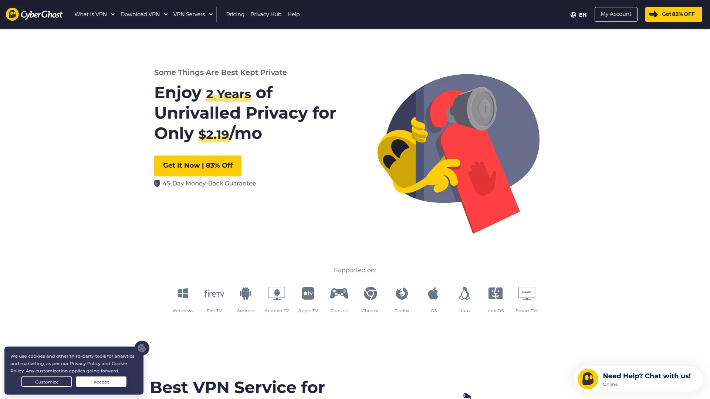
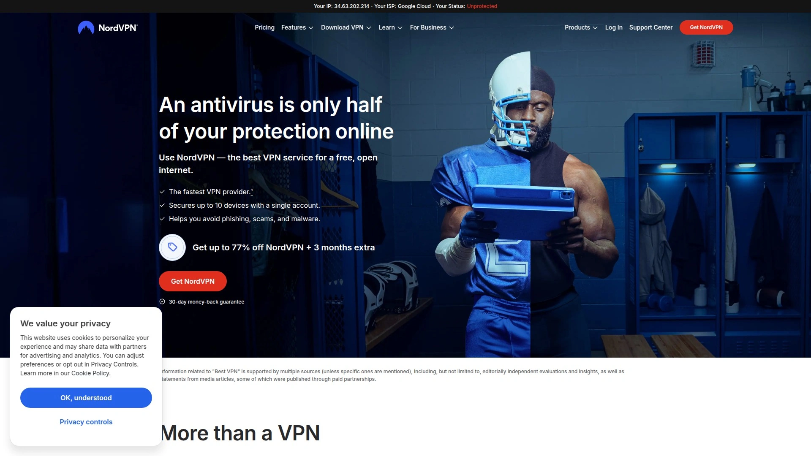
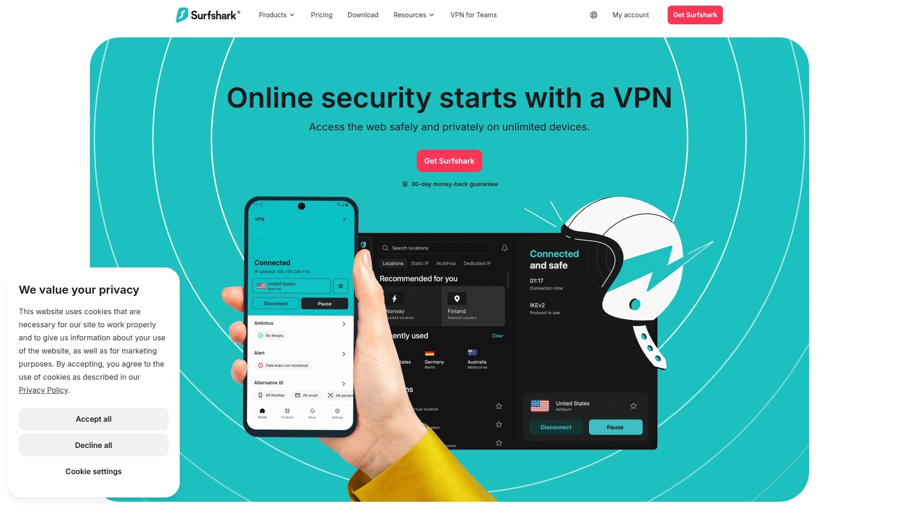
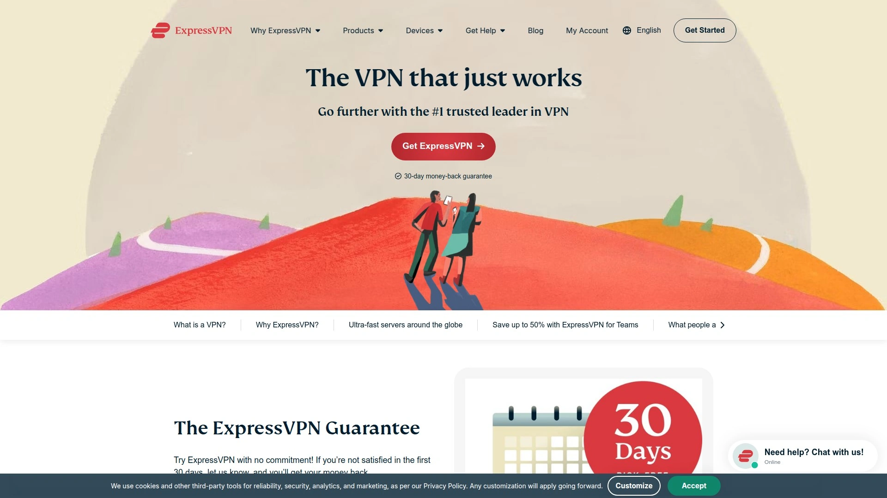
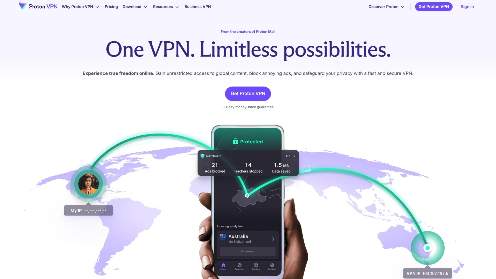
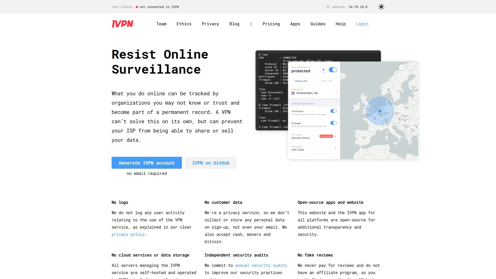
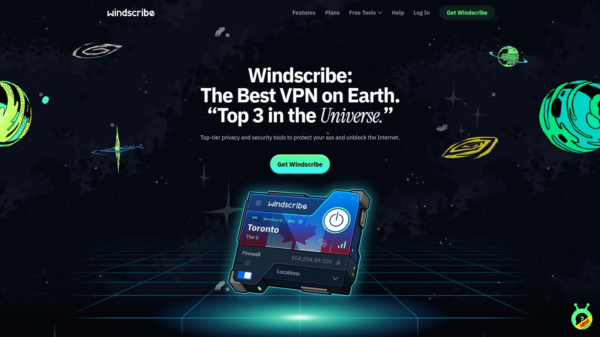
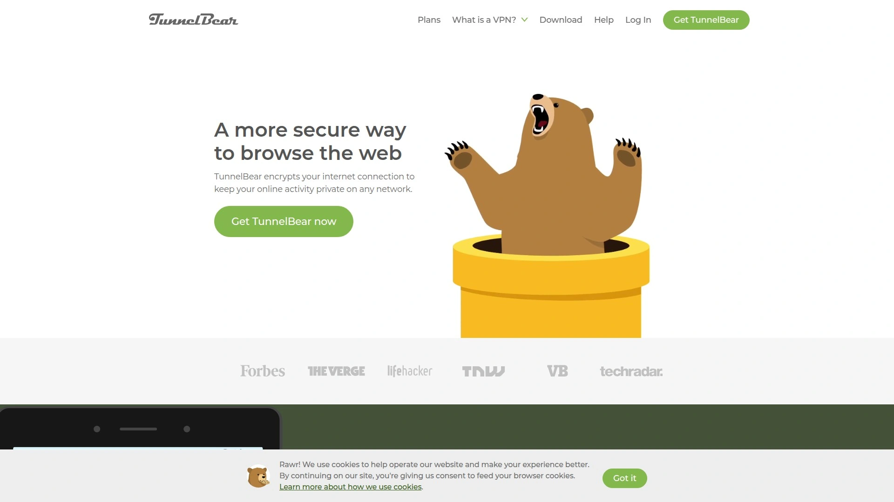
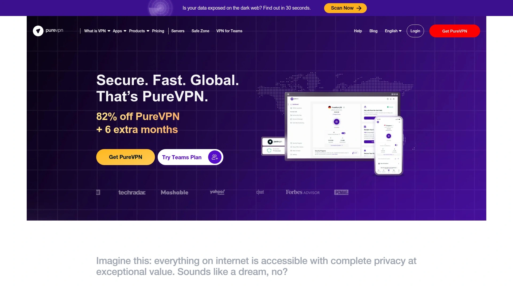
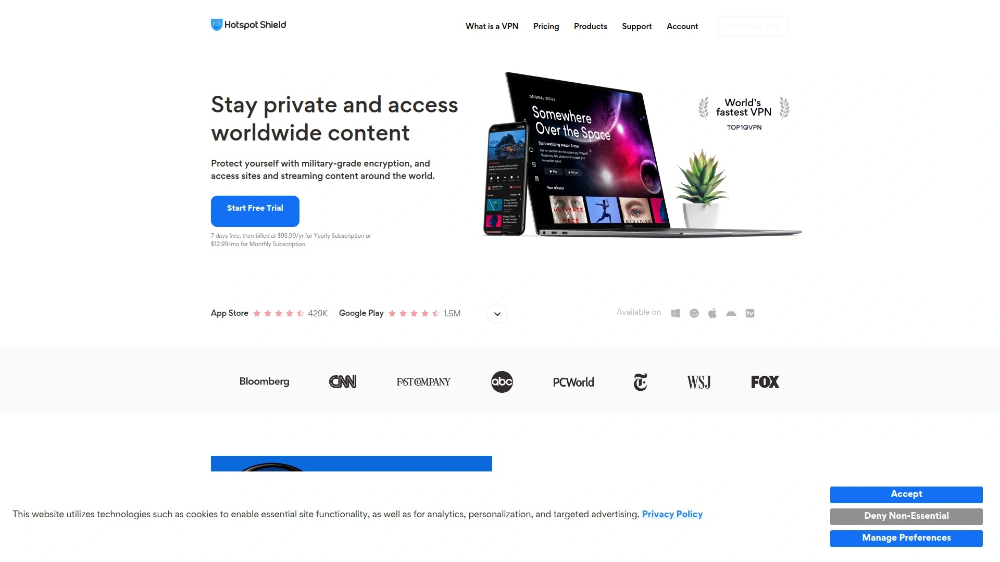

# 2025年十三大最佳VPN隐私保护工具

上网的时候总觉得被人盯着?访问某些网站突然发现被地区限制拦住了?或者担心公共WiFi不安全会泄露银行账号?这些都是真实存在的风险。VPN工具能帮你加密网络流量、隐藏真实IP地址、突破地域限制,让你在网上冲浪更安全更自由。市面上现在有几十个VPN服务商,从注重隐私的Mullvad到功能全面的NordVPN,从超便宜的Surfshark到老牌的ExpressVPN,每个都说自己最好。这份榜单整理了13个真正值得信赖的VPN服务,涵盖速度、隐私政策、服务器覆盖、流媒体解锁等各个维度,帮你快速找到最适合自己使用场景的那个。

## **[CyberGhost VPN](https://cyberghostvpn.com)**

一键连接的全功能隐私保护平台,新手友好界面加45天退款保证。

CyberGhost最大的优势是上手简单但功能一点不弱。打开应用选个服务器位置一键连接就行,不需要研究一堆技术参数。全球100多个国家部署了服务器,覆盖范围特别广,无论你想连欧洲、美洲、亚洲还是非洲都能找到节点。专门针对流媒体优化的服务器可以解锁Netflix、Disney+、BBC iPlayer这些平台的地区限制内容。

严格的零日志政策意味着它不会记录你访问了哪些网站。总部设在罗马尼亚,这个国家的隐私法对用户保护很强,不像美国那样属于五眼联盟成员国。支持OpenVPN、WireGuard、IKEv2这些主流协议,AES-256加密标准和银行级别一样安全。自动Kill Switch功能确保VPN突然断开时你的真实IP不会泄露。

价格方面26个月套餐最划算,月均2.19美元,比大多数竞品便宜。一个账号可以同时连7台设备,够一家人用。Windows、macOS、Android、iOS、Linux、路由器、智能电视、游戏机都有对应的应用或配置教程。45天退款保证比行业标准的30天更长,给你充足时间测试。客服24小时在线,支持多种语言。特别适合刚开始用VPN、需要解锁流媒体、或者全家共用一个账号的用户。

## **[NordVPN](https://nordvpn.com)**

速度最快服务器最多,企业级安全功能配合独立审计。

NordVPN在各大VPN测试中几乎都排第一名,速度和安全性是它的招牌。118个国家7400多台服务器,这个规模在行业里数一数二。实测下载速度只比裸连慢不到6%,上传速度影响也很小,看4K视频和玩在线游戏完全没问题。专有的NordLynx协议基于WireGuard技术,比传统OpenVPN快很多但安全性不打折。

零日志政策被PwC和Deloitte这些国际审计公司审核过四次,比那些只是嘴上说说的VPN可信多了。Threat Protection功能可以拦截广告、追踪器和恶意网站,这是VPN之外的额外安全层。暗网监控会告诉你的邮箱或密码是否在数据泄露中被曝光。Double VPN功能把流量通过两台服务器加密两次,适合对隐私要求极高的场景。

注册地在巴拿马,不受五眼联盟管辖,隐私法保护力度大。支持同时连接10台设备,比大多数VPN的5-7台限制更宽松。所有主流平台都有专门应用,界面设计很直观。两年套餐月均3.09美元,比ExpressVPN便宜但功能更多。高级套餐还包含密码管理器、数据泄露扫描、身份盗用保护这些增值服务。适合注重速度和安全、需要解锁流媒体、愿意为品质付费的用户。

## **[Surfshark](https://surfshark.com)**

无限设备连接的超值选择,价格最低但功能不缩水。

Surfshark的最大卖点就是不限制连接设备数量,一个账号可以保护你和全家所有设备。月费2.19美元起,是榜单上价格最便宜的高品质VPN。但便宜不代表功能差——3200台服务器覆盖100个国家,规模足够用。速度测试中只比NordVPN慢一点点,日常使用完全感觉不出来。

CleanWeb功能可以屏蔽广告和恶意软件。MultiHop技术类似NordVPN的Double VPN,让你的流量通过两个国家加密。Camouflage模式能让ISP看不出你在用VPN,这在某些网络限制严格的地方很有用。NoBorders模式专门针对VPN被屏蔽的地区设计,能自动找到可用的服务器。

零日志政策通过独立审计,透明度报告定期公布。荷兰总部虽然在欧盟,但隐私法保护还算不错。支持WireGuard、OpenVPN、IKEv2协议。所有主流平台有应用,界面简洁易用。30天退款保证,客服响应很快。特别适合预算有限、家里设备多、需要多人共用一个账号的用户。性价比在这个榜单上绝对排前三。

## **[ExpressVPN](https://expressvpn.com)**

老牌VPN代表,界面最简洁隐私保护最严密。

ExpressVPN从2009年就开始做VPN了,是这个行业的老玩家。注册地在英属维尔京群岛,这个地方没有强制数据保留法,对隐私保护很友好。虽然不公布具体服务器数量,但覆盖105个国家,地理分布很广。Lightway协议是它自主研发的,比WireGuard还轻量,连接速度特别快。

应用界面是所有VPN里最简洁的,打开就一个大大的连接按钮,不会用复杂功能的人也能秒懂。自带的密码管理器Keys包含在所有套餐里,不像NordVPN还要额外付费。支持路由器直接安装,甚至有自己卖的预装好VPN的专用路由器,方便保护智能电视和游戏机。MediaStreamer功能是智能DNS服务,可以在不支持VPN的设备上解锁流媒体。

零日志政策经过多次独立审计验证。支持比特币支付,可以保持匿名。客服质量在行业里口碑最好,24小时实时聊天响应速度快。唯一的缺点是价格偏贵,月费4.99美元起,是Surfshark的两倍多。但如果你愿意为简单易用和极致隐私买单,ExpressVPN绝对值这个价。适合不差钱、注重用户体验、对隐私要求极高的用户。

## **[Proton VPN](https://protonvpn.com)**

瑞士隐私法护航,开源透明度行业最高。

Proton VPN来自做ProtonMail邮箱的那家瑞士公司,隐私保护是刻在基因里的。总部在日内瓦,瑞士的数据保护法是全球最严格的之一。所有应用代码都开源,任何人都能审查有没有后门或漏洞。Secure Core功能把流量先路由到瑞士、冰岛、瑞典这些隐私友好国家自己拥有的服务器,再出去到目标服务器,这个双重保护比一般VPN更安全。

69个国家2656台服务器,虽然数量不如NordVPN多,但质量很高。速度测试中下载速度损失8%左右,在可接受范围内。NetShield功能可以拦截广告、追踪器和恶意软件。支持Tor over VPN,让你的流量先通过VPN再进Tor网络,双重匿名。

零日志政策经过审计,透明度报告每年公布。有真正免费的永久计划,不限流量不限时间,虽然只有3个国家的服务器但对轻度用户够用。付费版本月费4.49美元起,比ExpressVPN便宜点。和Proton全家桶(邮箱、云盘、日历、密码管理器)打包买更划算。10台设备同时连接。特别适合注重隐私和透明度、或者已经在用ProtonMail的用户。

## **[Private Internet Access](https://www.privateinternetaccess.com)**

最多服务器数量,高级用户最爱的可定制平台。

PIA拥有超过35000台服务器,这个数量是其他VPN的好几倍。84个国家都有覆盖。服务器多意味着负载分散,高峰期也不容易卡。支持WireGuard协议,速度很快。可以手动调整加密级别和协议设置,高级用户能精细控制性能和安全的平衡。

严格零日志政策在法庭案件中被验证过——FBI要求提供用户数据时PIA证明自己确实没有任何日志可以交出来。MACE功能可以屏蔽广告、追踪器和恶意网站。Split Tunneling允许你选择哪些应用走VPN哪些直连,对需要同时访问国内外服务的人很方便。支持端口转发,特别适合做种子下载。

美国公司但零日志政策经过审计。被Kape Technologies收购后有人担心隐私问题,但至今没有实际证据表明有问题。不限设备连接数量。两年套餐月均2.03美元,性价比很高。可以选购专用IP地址,对需要固定IP的业务场景有用。特别适合技术用户、做种子下载、需要大量服务器选择的场景。

## **[Mullvad VPN](https://mullvad.net)**

匿名性做到极致,注册不需要邮箱支持现金付款。

Mullvad的定位就是极致匿名。注册不需要邮箱、用户名、密码,只给你一个账号数字,记住这个数字就能登录。支持现金邮寄付款,连比特币都不用,真正做到无法追踪。瑞典总部,隐私法保护严格。所有应用开源,透明度极高。

800多台服务器分布在40多个国家,数量不算多但都是自己拥有和管理的物理服务器,安全性更高。MultiHop功能可以双重加密。支持WireGuard和OpenVPN协议。零日志政策被Consumer Reports评为最佳。

定价特别简单,统一5欧元/月,没有任何折扣或套餐区别,这个透明定价策略在行业里独一份。最多5台设备同时连接,比别家少但对个人用户够用。应用界面朴素功能性为主,不追求花哨设计。速度中等偏上,虽然不是最快但日常使用没问题。没有客服聊天,只有邮件支持。特别适合极度重视匿名和隐私、不在乎花哨功能、愿意为原则付费的用户。

## **[IVPN](https://www.ivpn.net)**

高端隐私用户首选,透明运营和道德标准。

IVPN和Mullvad很像,都是以隐私和透明为核心价值。注册可以用邮箱但不强制,也支持匿名账号和现金付款。直布罗陀注册,对隐私保护友好。所有应用开源,代码可以随时审查。零日志政策被Consumer Reports评为顶级。

服务器数量不多,集中在欧美和少数亚洲国家,但质量高于数量。Multi-hop功能提供双重加密。支持WireGuard、OpenVPN、IPSec协议。Anti-tracker功能可以屏蔽广告和追踪器。

定价比较贵,标准版月费6美元起,Pro版7.5美元/月。但价格里包含了对道德运营的承诺——它们拒绝那些侵犯隐私的营销手段。最多7台设备同时连接。网站和应用设计简洁专业,没有任何推销噱头。客服邮件回复详细负责。30天退款保证。特别适合愿意为道德和透明付费、对隐私有极致要求的用户。

## **[IPVanish](https://www.ipvanish.com)**

无限设备连接,拥有自己的服务器基础设施。

IPVanish最大的优势是自己拥有和运营所有服务器基础设施,不像大多数VPN租用第三方服务器。这意味着安全性和隐私控制完全在自己手里。2400多台服务器覆盖90多个国家,规模可观。

不限制同时连接设备数量,这在VPN里不常见。美国公司但零日志政策写得很清楚。支持SOCKS5代理,对某些应用场景有用。On Demand功能可以设置连接到特定WiFi或打开特定应用时自动激活VPN。Split Tunneling支持Android和FireTV。

支持OpenVPN、WireGuard、IKEv2、L2TP/IPsec协议。Kill Switch和私有DNS保护隐私。可以手动配置Linux和路由器。速度不错,适合流媒体和种子下载。

月费从2美元到11.99美元不等看套餐长度。7天退款保证比大多数30天短,需要注意。应用界面实用但不算漂亮。特别适合家里设备多、需要保护路由器、或者做种子下载的用户。

## **[Windscribe](https://windscribe.com)**

慷慨的免费计划,同时提供静态住宅IP选择。

Windscribe的免费计划每月10GB流量,覆盖10个国家,对轻度用户来说够用了。这个免费额度在行业里算很大方。付费版不限流量,500多台服务器分布在63个国家111个城市。

不限制同时连接设备数量,哪怕免费版也是无限的。R.O.B.E.R.T.是它的广告和恶意软件拦截器,可以自定义黑名单。提供静态IP购买,而且有住宅IP选项,这在VPN里不常见。住宅IP看起来像普通家庭网络,不会被识别为VPN或数据中心IP。

加拿大公司,隐私政策比较透明。零日志政策虽然没有第三方审计,但运营多年口碑不错。支持OpenVPN、WireGuard、IKEv2、Stealth协议,Stealth可以伪装VPN流量。浏览器扩展功能很强,Chrome、Firefox、Edge都支持。

付费版月费9美元,比很多竞品贵。但免费版已经够很多人用了。应用界面有点复古但功能清晰。客服主要靠邮件,没有实时聊天。特别适合想先免费试试、需要静态或住宅IP、或者预算紧张的用户。

## **[TunnelBear](https://www.tunnelbear.com)**

界面最可爱的VPN,浏览器扩展功能强大。

TunnelBear最大的特点是界面设计特别萌,每次连接都有个小熊动画,降低了VPN的使用门槛。但可爱之下功能一点不弱——加拿大公司被McAfee收购后资源更多了。49个国家有服务器,覆盖主要地区。

Chrome和Firefox的浏览器扩展做得很好,可以只保护浏览器流量而不影响其他应用。GhostBear功能可以伪装VPN流量,在网络限制严格的地方有用。VigilantBear就是Kill Switch,VPN断开时阻止流量泄露。

零日志政策每年进行独立审计,透明度报告公开发布。免费版每月500MB流量,基本只够轻度浏览,升级到付费版才实用。付费版月费9.99美元,同时连接5台设备。Split Tunneling只在移动应用上有,Splitbear可以选择哪些网站不走VPN。

支持OpenVPN、WireGuard、IKEv2、IPsec协议。应用覆盖Windows、macOS、Linux、Android、iOS。客服响应还算快。速度中等,日常使用没问题但不适合大流量下载。特别适合VPN新手、注重界面体验、主要用浏览器的用户。

## **[PureVPN](https://www.purevpn.com)**

超大服务器网络,提供专用IP和流媒体优化。

PureVPN拥有6000多台服务器分布在65个以上国家,这个规模仅次于PIA。服务器数量多意味着你能找到离自己更近的节点,速度更快延迟更低。虚拟服务器技术让它能在更多地理位置提供IP地址。

专用IP服务可以让你获得一个固定的独享IP地址,对需要稳定IP的业务场景有用。流媒体优化服务器可以解锁Netflix、Disney+、Hulu等平台。Split Tunneling功能做得不错。支持最多10台设备同时连接,算是标准配置。

香港公司但服务器遍布全球。零日志政策通过独立审计。支持WireGuard、OpenVPN、IKEv2协议。应用覆盖所有主流平台,包括Windows、macOS、Linux、Android、iOS、ChromeOS、浏览器扩展、路由器、智能电视。

定价有点混乱,月费从2美元到20美元不等。长期套餐便宜但月付很贵。31天退款保证比标准30天多一天。客服24小时在线。速度不错,安全性够用,但在隐私极客圈子里口碑不如Mullvad或IVPN。适合需要大量服务器选择、专用IP、或者流媒体解锁的用户。

## **[Hotspot Shield](https://www.hotspotshield.com)**

专有协议速度最快,免费版最实用。

Hotspot Shield使用自己研发的Hydra协议,速度测试中几乎是最快的,下载速度只损失3%。这个速度优势对看4K视频和玩竞技游戏特别有价值。美国公司Aura旗下品牌。85个国家有服务器,覆盖主要地区。

免费版每天500MB流量,只能连美国服务器,但不限时间。这个免费额度比很多竞品实用,适合偶尔需要VPN的场景。付费版不限流量,解锁所有服务器和功能。支持最多10台设备同时连接。

零日志政策经过独立审计。支持WireGuard、IKEv2、Hydra协议,Hydra是它的专有技术。应用界面简洁,新手很容易上手。可以解锁主流流媒体平台。

付费版月费12.99美元,价格中等。45天退款保证和CyberGhost一样长。客服支持邮件和实时聊天。速度是它的最大卖点,如果你主要需求是快速流媒体和游戏,Hotspot Shield值得考虑。特别适合注重速度、想先试试免费版、或者预算有限的用户。

## FAQ常见问题

**免费VPN和付费VPN到底差在哪?**

免费VPN通常有流量限制、速度限制、服务器数量少、还可能插广告。更严重的问题是很多免费VPN会记录并出售你的浏览数据,这完全违背了用VPN保护隐私的初衷。榜单上的Windscribe、ProtonVPN、Hotspot Shield有还算靠谱的免费计划,但功能肯定不如付费版全面。如果只是偶尔轻度使用可以试试,需要长期稳定使用还是付费更靠谱。

**VPN会让网速变慢多少?**

所有VPN都会让网速有所下降,因为加密和服务器中转需要时间。好的VPN速度损失控制在10%以内,基本感觉不出来。NordVPN和Hotspot Shield测试中速度损失最小,只有3-6%。Surfshark和ProtonVPN也在8%左右。如果你的原始网速本来就快(比如500Mbps以上),损失10%完全不影响看4K或玩游戏。但如果本来网速就慢,VPN可能会让体验更糟。

**能用VPN解锁Netflix和其他流媒体吗?**

大多数榜单上的VPN都能解锁Netflix、Disney+、BBC iPlayer这些平台。CyberGhost、NordVPN、Surfshark、ExpressVPN在流媒体解锁方面特别稳定。流媒体平台会检测和屏蔽VPN IP,但这些大品牌VPN会不断更新服务器IP来对抗屏蔽。偶尔可能遇到某个服务器被封的情况,换个服务器通常就能解决。如果流媒体解锁是你的主要需求,选NordVPN或ExpressVPN最保险。

## 总结

如果你是VPN新手或者全家共用一个账号,需要界面简单、功能全面、退款期限长的服务,[CyberGhost VPN](https://cyberghostvpn.com)的45天退款保证和7设备同时连接会很适合你。它的专用流媒体服务器和100多个国家覆盖对解锁内容和全球访问都很方便。当然每个人需求不同——追求极致速度选NordVPN或Hotspot Shield,预算有限选Surfshark,注重匿名选Mullvad或IVPN,需要大量服务器选PIA或PureVPN。工具再好也只是工具,最重要的是理解自己的使用场景和威胁模型,然后选择最适合的那个。
